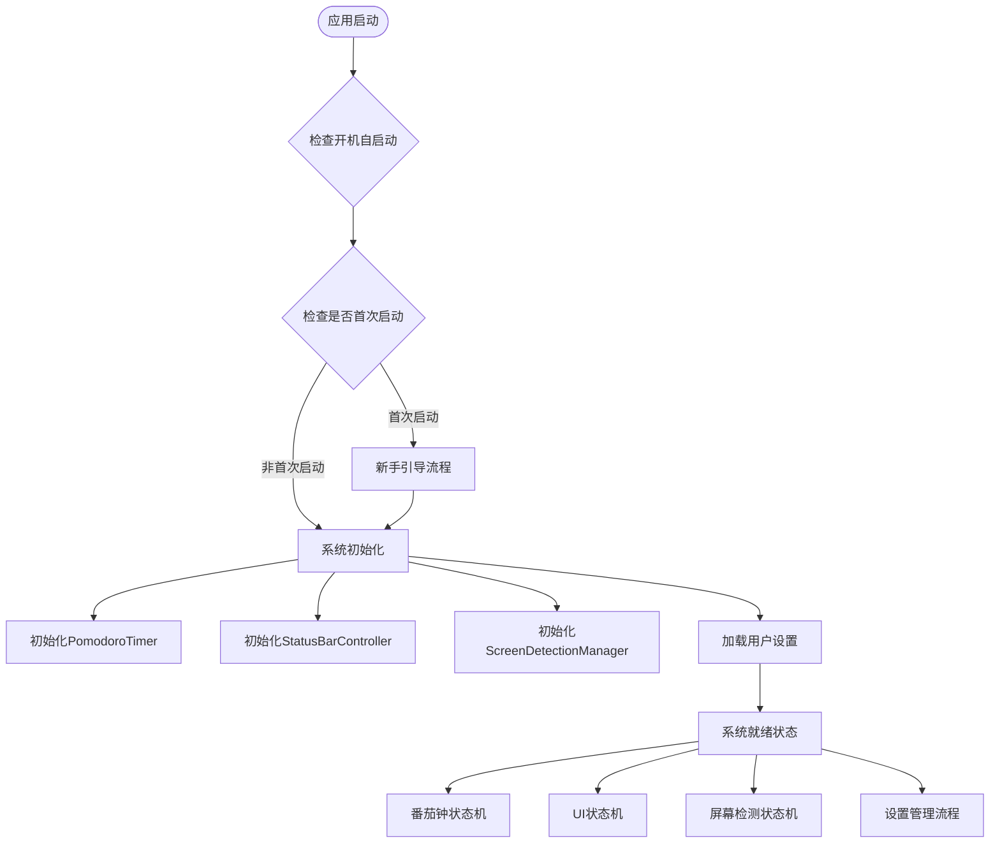
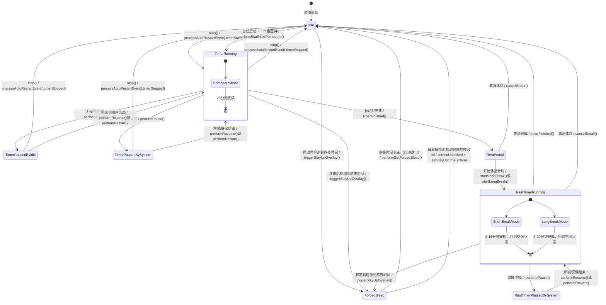
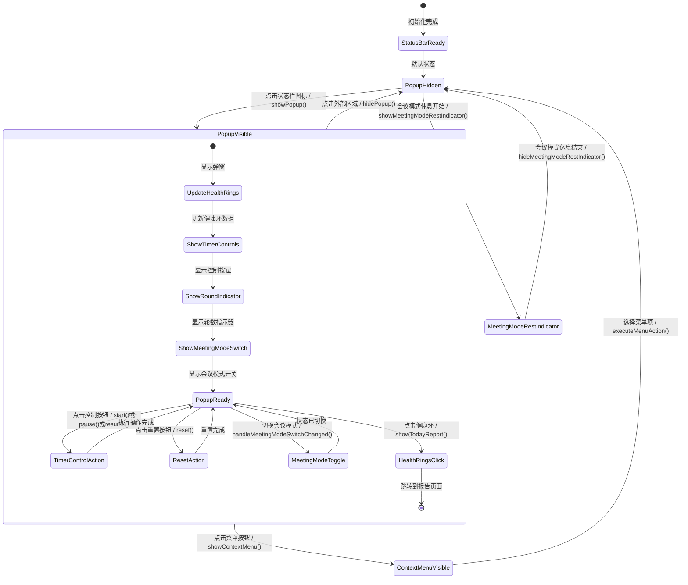
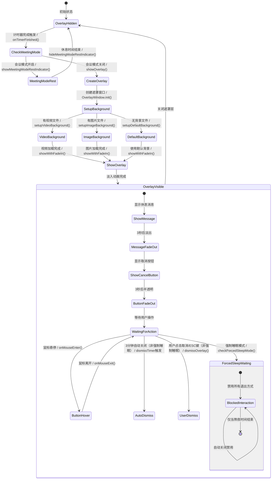
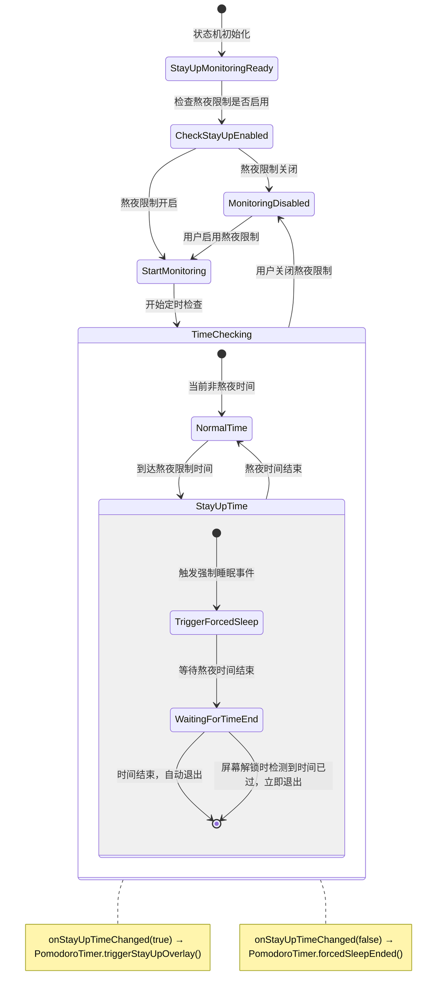
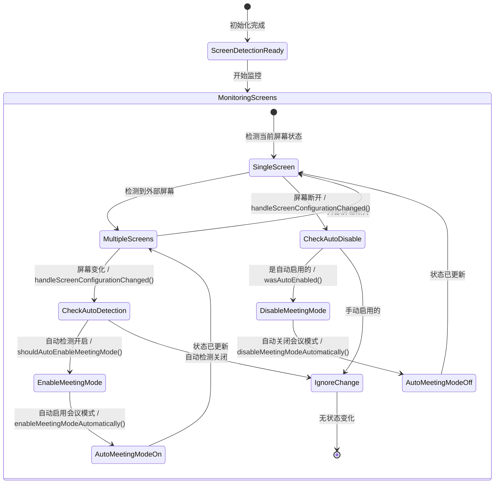
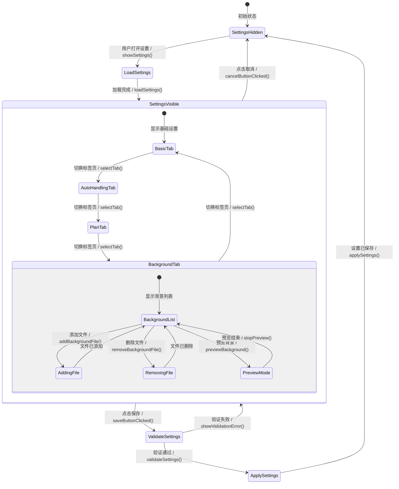
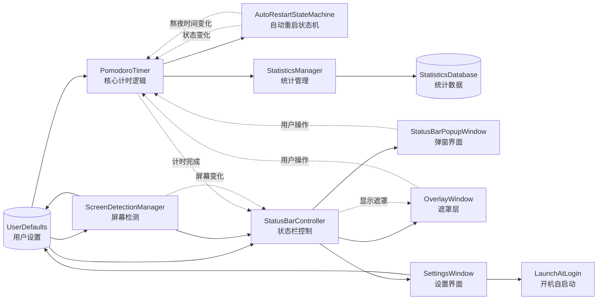

# PomodoroScreen 状态转换图

基于代码分析构建的完整状态转换图，展示了番茄钟应用的所有状态转换和交互关系。

## 系统整体架构状态图

## 核心番茄钟状态机 (PomodoroTimer + AutoRestartStateMachine)

## UI状态机 (StatusBarController + StatusBarPopupWindow)

## 遮罩层状态机 (OverlayWindow)

## 熬夜状态管理机 (AutoRestartStateMachine 熬夜功能)

## 屏幕检测状态机 (ScreenDetectionManager)

## 设置管理状态机 (SettingsWindow)

## 数据流和组件交互

## 关键事件和触发条件

### 计时器事件
- **timerStarted**: 计时器启动
- **timerStopped**: 计时器停止
- **timerPaused**: 计时器暂停
- **pomodoroFinished**: 番茄钟完成 → 触发休息期间
- **restStarted**: 休息开始
- **restFinished**: 休息完成 → 回到空闲状态 → 自动开始下一个番茄钟
- **restCancelled**: 休息被取消 → 回到空闲状态

### 系统事件
- **idleTimeExceeded**: 无操作时间超时
- **userActivityDetected**: 检测到用户活动
- **screenLocked**: 屏幕锁定
- **screenUnlocked**: 屏幕解锁（在强制睡眠状态下会智能检测是否还在熬夜时间）
- **screensaverStarted**: 屏保启动
- **screensaverStopped**: 屏保停止

### 特殊事件
- **forcedSleepTriggered**: 强制睡眠触发（状态机检测到熬夜时间）
- **forcedSleepEnded**: 强制睡眠结束（熬夜时间结束，自动退出）
- **stayUpTimeEntered**: 进入熬夜时间（状态机监控）
- **stayUpTimeExited**: 退出熬夜时间（状态机监控）
- **screenConfigurationChanged**: 屏幕配置变化
- **meetingModeToggled**: 会议模式切换

## 状态持久化

### UserDefaults 存储的状态
- 基础设置：番茄钟时间、休息时间、自动启动等
- 自动处理设置：无操作重启、锁屏处理、屏保处理等
- 计划设置：长休息周期、累积时间等
- 背景设置：背景文件列表和播放参数
- 熬夜限制：启用状态和时间设置（通过状态机管理）
- 会议模式：启用状态和自动检测设置
- 界面设置：状态栏文字显示、开机自启动等

### 运行时状态
- 计时器当前状态和剩余时间
- 已完成的番茄钟次数
- 累积的休息时间
- 当前背景文件索引
- 屏幕检测状态
- 熬夜状态（由状态机管理）
- UI组件的显示状态

## 错误处理和恢复机制

### 自动恢复
- 计时器异常时自动重置到安全状态
- 背景文件加载失败时使用默认背景
- 屏幕检测异常时禁用自动切换
- 设置加载失败时使用默认值
- 强制睡眠状态在屏幕解锁时智能检测时间，自动退出过期的强制睡眠

### 用户干预
- 强制睡眠状态不可被用户取消（仅当熬夜时间结束时自动退出）
- 遮罩层提供ESC键快速退出（强制睡眠期间除外）
- 设置界面提供取消和重置功能
- 状态栏右键菜单提供紧急控制

这个状态转换图展示了PomodoroScreen应用的完整状态管理架构，包括了所有主要组件的状态转换逻辑、数据流向和交互关系。
